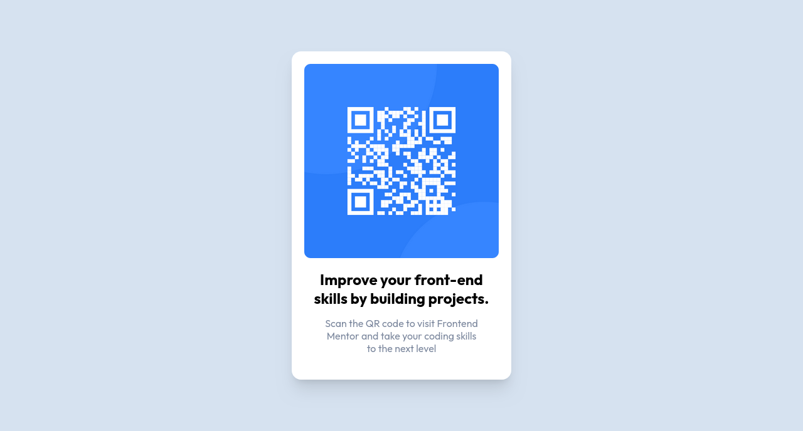

# Frontend Mentor - QR code component solution

This is a solution to the [QR code component challenge on Frontend Mentor](https://www.frontendmentor.io/challenges/qr-code-component-iux_sIO_H). Frontend Mentor challenges help you improve your coding skills by building realistic projects. 

## Table of contents

- [Overview](#overview)
  - [Screenshot](#screenshot)
  - [Links](#links)
- [My process](#my-process)
  - [Built with](#built-with)
  - [What I learned](#what-i-learned)
  - [Continued development](#continued-development)
- [Author](#author)

## Overview

### Screenshot



### Links

- Solution URL: [Add solution URL here](https://your-solution-url.com)
- Live Site URL: [Add live site URL here](https://your-live-site-url.com)

## My process

### Built with

- HTML5 markup
- CSS custom properties

### What I learned

At first, this challenge seemed easy but when I started, I got a little bit stuck, I tried using CSS flexbox, but it wasn't working and also the text p and h1 text had different bg-color, it wasn't the same with the div so I changed the code from;

```css
*{
  background-color:......
}
to
body {
  background-color:.....
}
```
and I got the required effect.
It has been a great learning experience for me and I can't wait to move on to the next project.


### Continued development

I'm going to focus on my CSS, I sometimes tend to forget the property values for a particular effect.


## Author

- Frontend Mentor - [@ZenitsuAg](https://www.frontendmentor.io/profile/ZenitsuAg)
- Twitter - [@freddyR9](https://www.twitter.com/freddyR9)

